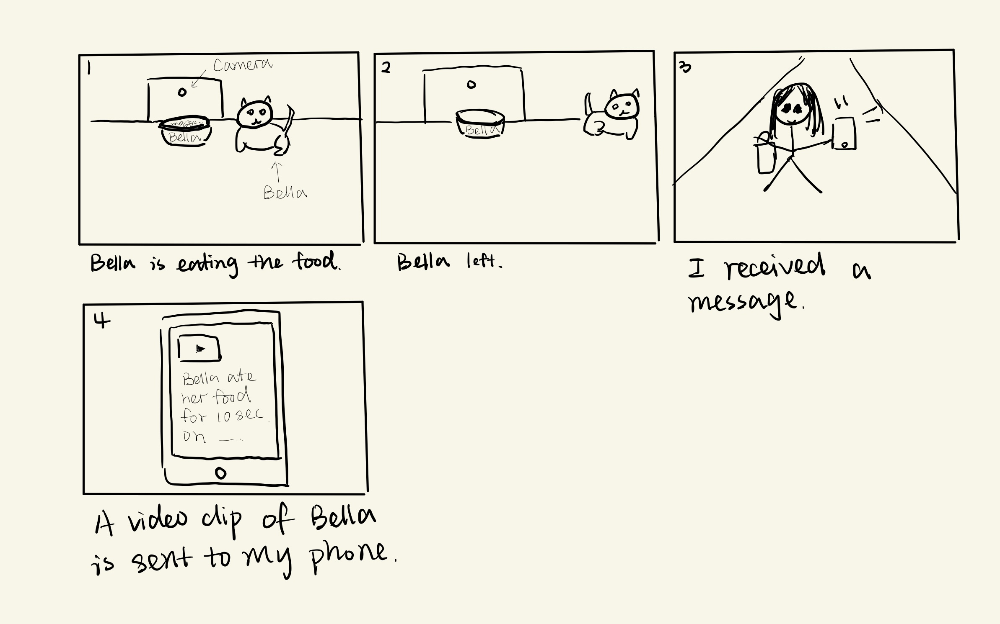
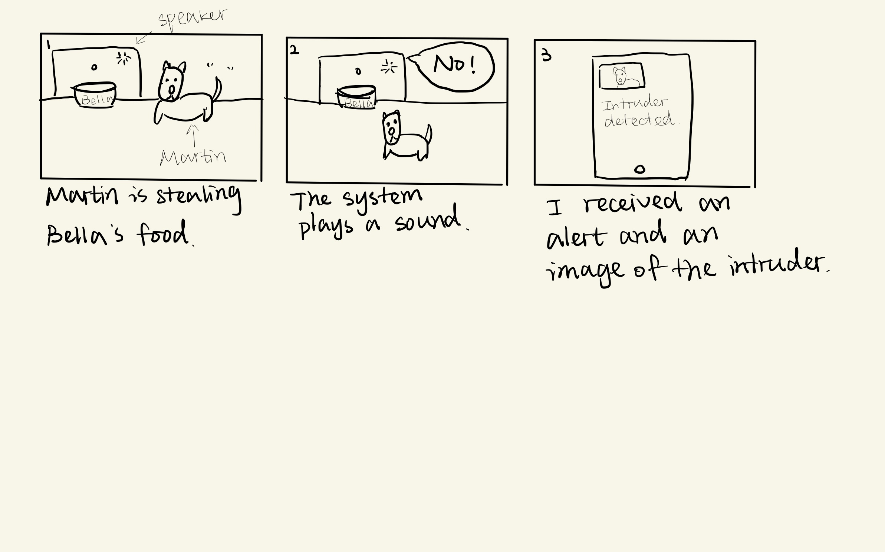
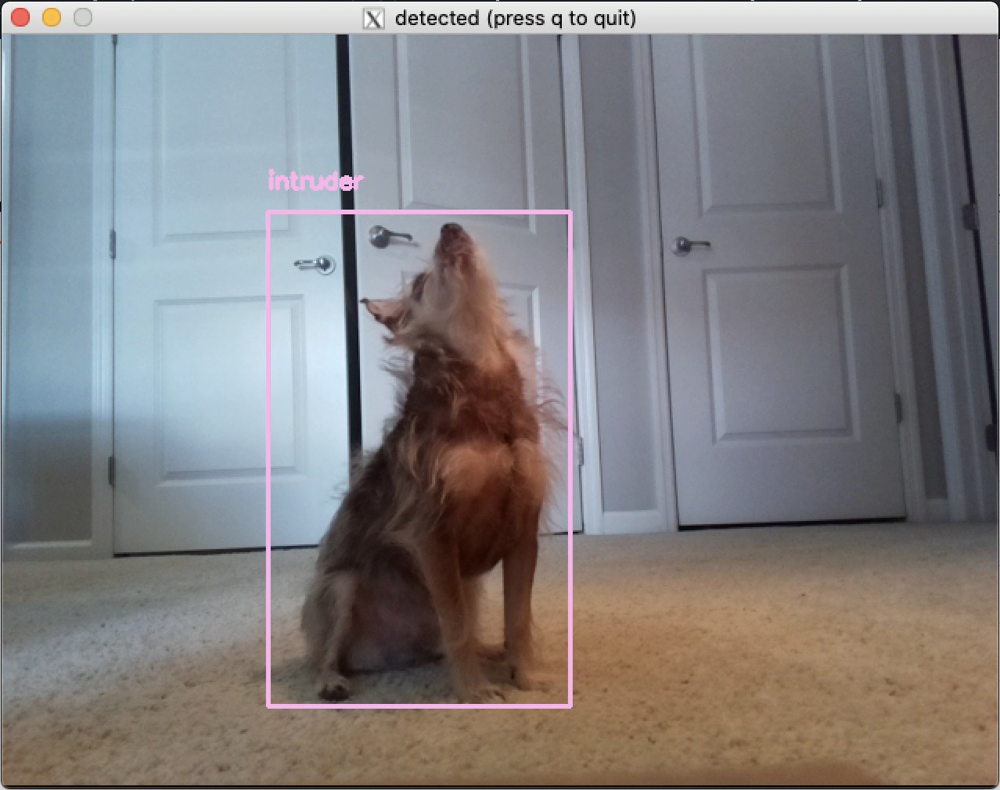
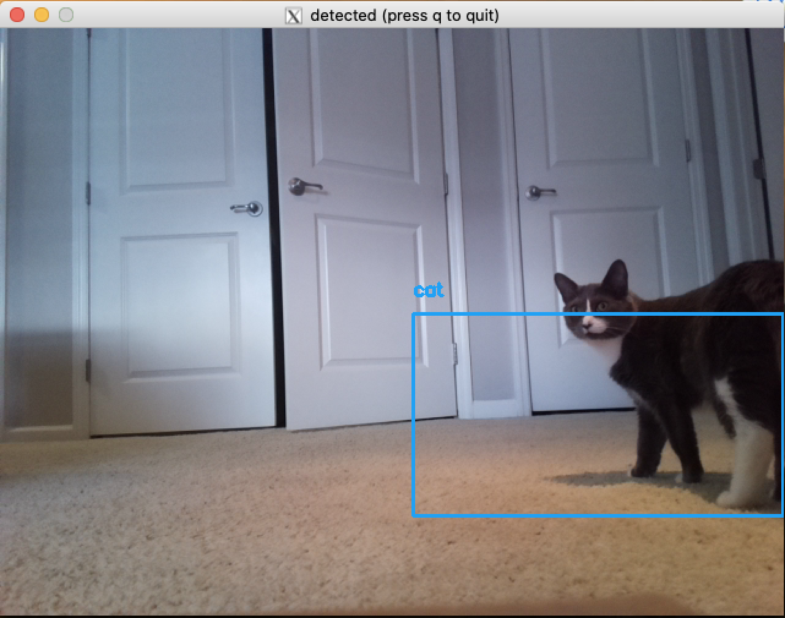
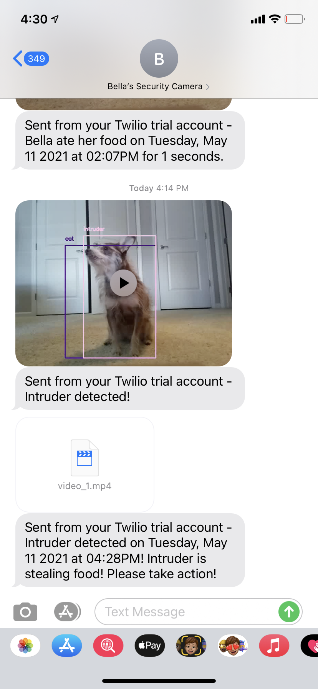
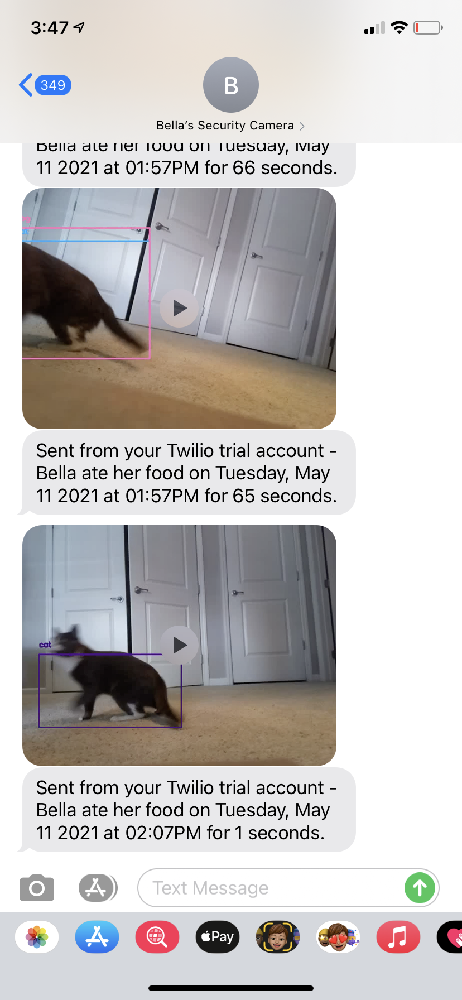

# Final Project

Using the tools and techniques you learned in this class, design, prototype and test an interactive device.

Project Github page set up - May 3

Functional check-off - May 10
 
Final Project Presentations (video watch party) - May 12

Final Project Documentation due - May 19

 
## Description
For this project, I built a security camera to understand my cat Bella's eating schedule. The camera is placed in front of Bella's bowl and it sends an image/video clip via text message to my phone when it detects Bella. The system allows me to have a better understanding of Bella's eating habbit especially when I'm not at home. It can also detect intruders (in my case, a dog) and send a photo of the intruder to my phone. When it detects an intruder, the system plays a pre-recorded audio: " No! Bad boy!"

https://youtu.be/0V6QAqEnvfo

## Documentation

The original idea was to build an IoT-capable security camera that sends a video clip of Bella to me whenever she eats her food. The system can be useful especially when I'm not at hoem. THe idea of the interaction is shown here:



After making the security camera, I realized that my dog Martin sometimes steals Bella's food when I'm not around. Therefore, I added additional functionality to make the system capable of recognizing Martin the intruder.



I used AWS S3 to store recorded videos/images and Twilio to send the stored videos/images to my phone via text messages.

Security Camera V 1.0 can only detect my cat Bella. The system starts counting when my cat is in the scene. It sends a 2 seconds video to my phone if the cat stays in the scene for 2 seconds.

Security Camera V 2.0 can protect Bella's food. It detects my dog Martin as an intruder and sends a message to my phone. It also plays a pre-recorded audio "No! Bad boy!"

To use the system, run ```python3 detect.py --conf config/config.json```

Here are some examples of the detection output:



Some messages I received:



Some of the issues I found:
1. The detection accuracy is not great. Bella can be recognized both as a cat and a dog in one frame.
2. When my cat is detected as both as a dog and as a cat in continuous frames, I will receive multiple messages. Here is a video showing a failure example: https://youtu.be/voapi1MoN7Y
3. If Bella sits in front of the camera for the entire afternoon, my phone will explode (because the system will keep sending me videos).

Here are some of the improvements I made to the system:
1. Modify the code to allow one predicted class per frame.
2. Only allow the system to send me a message and a video clip if Bella is in the scene for more than 2 seconds. If Bella stays in the scene for more than 20 seconds, the camera stops recording and send me a message saying "Bella is still eating."
3. Add a threshold of 2 seconds for Martin's detection in case Martin is just passing by.

## Reflection

1. The system works well when there is a good light source. I have to turn on the lights in order for it to work at night.
2. The bowl needs to be placed 30 centimeters away from the camera for the system to better detect Bella and Martin.
3. Bella and Martin are still sometimes misdetected. My guess is that Bella and Martin are approximately of the same size. Martin does look like a cat sometimes.
