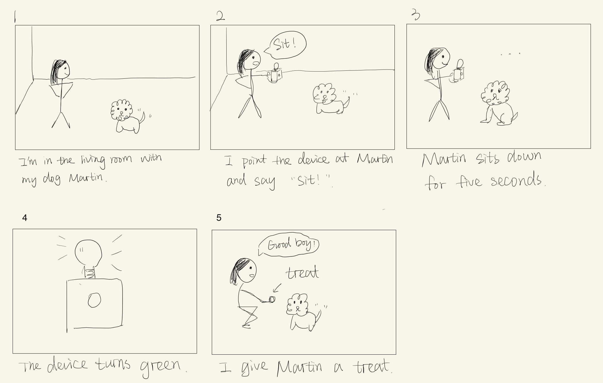
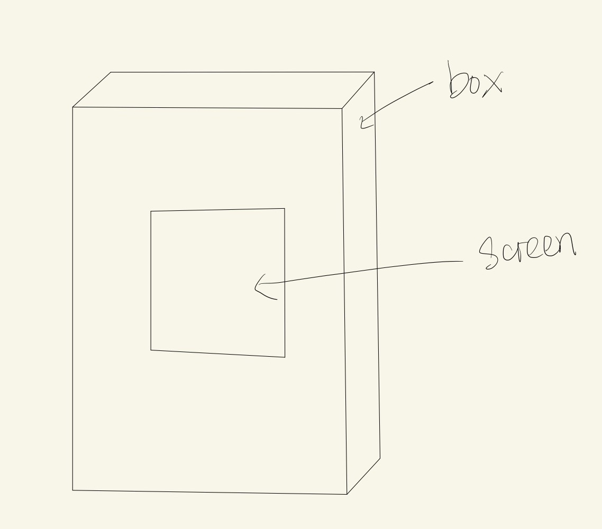
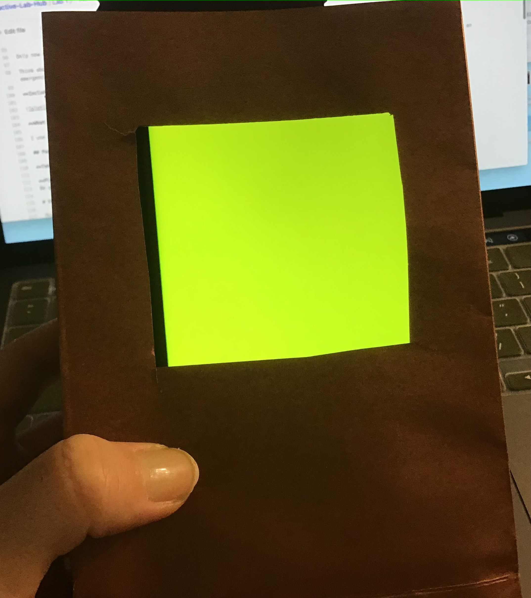

# Staging Interaction

In the original stage production of Peter Pan, Tinker Bell was represented by a darting light created by a small handheld mirror off-stage, reflecting a little circle of light from a powerful lamp. Tinkerbell communicates her presence through this light to the other characters. See more info [here](https://en.wikipedia.org/wiki/Tinker_Bell). 

### For lab, you will need:

1. Paper
1. Markers/ Pen
1. Smart Phone--Main required feature is that the phone needs to have a browser and display a webpage.
1. Computer--we will use your computer to host a webpage which also features controls
1. Found objects and materials--you’ll have to costume your phone so that it looks like some other device. These materials can include doll clothes, a paper lantern, a bottle, human clothes, a pillow case. Be creative!
1. Scissors

### Deliverables for this lab are: 
1. Storyboard
1. Sketches/photos of costumed device
1. Any reflections you have on the process.
1. Video sketch of the prototyped interaction.
1. Submit these in the lab1 folder of your class [Github page], either as links or uploaded files. Each group member should post their own copy of the work to their own Lab Hub, even if some of the work is the same for each person in the group.

## Overview
For this assignment, you are going to 

A) [Plan](#part-a-plan) 

B) [Act out the interaction](#part-b-act-out-the-interaction) 

C) [Prototype the device](#part-c-prototype-the-device)

D) [Wizard the device](#part-d-wizard-the-device) 

E) [Costume the device](#part-e-costume-the-device)

F) [Record the interaction](#part-f-record)

## The Report
This readme.md page in your own repository should be edited to include the work you have done. You can delete everything but the headers and the sections between the **stars**. Write the answers to the questions under the starred sentences. Include any material that explains what you did in this lab hub folder, and link it in the readme.

Labs are due on Mondays. Make sure this page is linked to on your main class hub page.

## Part A. Plan 

**Describe your setting, players, activity and goals here.**

_Setting:_ The interaction is happening in my living room. The interaction happens when I uses the device to train my dog how to sit.

_Players:_ My dog Martin and I will be involved in the interaction. Other people may also be in the setting, but the device will only respond to one person and one dog at a time.

_Activity:_ When I say "sit", if Martin sits down and remains still for five seconds, the device will turn green to indicate that I should give him a treat.

_Goals:_ Martin's goal is to get a treat. My goal is to give him a treat when he sits down for five seconds.

**Include a picture of your storyboard here**

**Summarize feedback you got here.**

My classmates think that the device can be helpful for training a dog. With some adjustment, the device can be designed as an automatic feeder.

## Part B. Act out the Interaction

**Are there things that seemed better on paper than acted out?**

Giving a treat while I am holding the device is not very convenient. If I put the device on the ground, the devie cannot always point to my dog because he loves to move around. I'm also going to change 5 seconds to 3 seconds because Martin doesn't like to sit for long.

**Are there new ideas that occur to you or your collaborators that come up from the acting?**

We can add more functions to the device to make it an automatic feeder.

## Part C. Prototype the device

You will be using your smartphone as a stand-in for the device you are prototyping. You will use the browser of your smart phone to act as a “light” and use a remote control interface to remotely change the light on that device. 

Code for the "Tinkerbelle" tool, and instructions for setting up the server and your phone are [here](https://github.com/FAR-Lab/tinkerbelle).

We invented this tool for this lab! 
**Give us feedback on Tinkerbelle.**

## Part D. Wizard the device

**Include your first attempts at recording the set-up video here.**

https://youtu.be/qkzSsuCgXVg

**Show the follow-up work here.**

https://youtu.be/LlPKwBYzgYA

## Part E. Costume the device

Only now should you start worrying about what the device should look like. Develop a costume so that you can use your phone as this device.

Think about the setting of the device: is the environment a place where the device could overheat? Is water a danger? Does it need to have bright colors in an emergency setting?

**Include sketches of what your device might look like here.**

**What concerns or opportunitities are influencing the way you've designed the device to look?**

I use a paper box to cover my phone so that the device is lightweight and looks like a box. I cut off a square on the box to show the screen. 

## Part F. Record

**Take a video of your prototyped interaction.**

https://youtu.be/E7K-R0XNDok

**Please indicate anyone you collaborated with on this Lab.**

I'd like to thank Andrew Tsai, Haoran Yin, and Tianyou Xiao for giving me feedback on the interaction plan.

# Staging Interaction, Part 2 

This describes the second week's work for this lab activity.

## Prep (to be done before Lab on Wednesday)

You will be assigned three partners from another group. Go to their github pages, view their videos, and provide them with reactions, suggestions & feedback: explain to them what you saw happening in their video. Guess the scene and the goals of the character. Ask them about anything that wasn’t clear. 

**Summarize feedback from your partners here.**

## Make it your own

Do last week’s assignment again, but this time: 
1) It doesn’t have to (just) use light, 
2) You can use any modality (e.g., vibration, sound) to prototype the behaviors, 
3) We will be grading with an emphasis on creativity. 

**Document everything here.**
