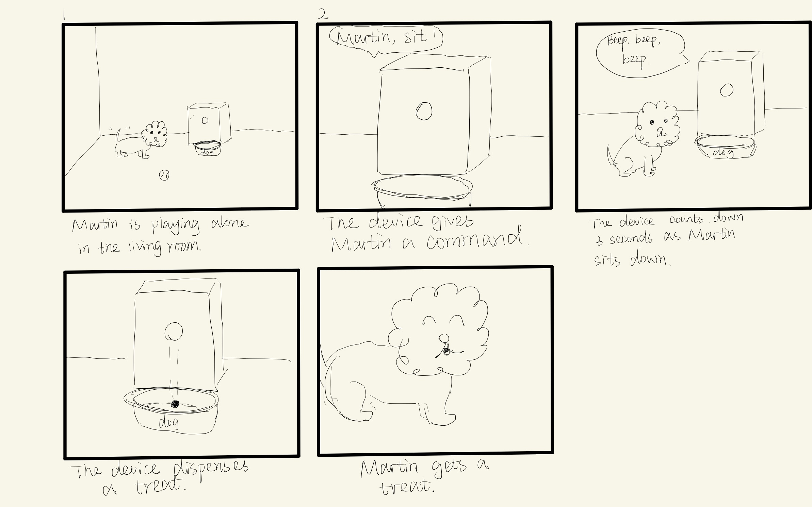
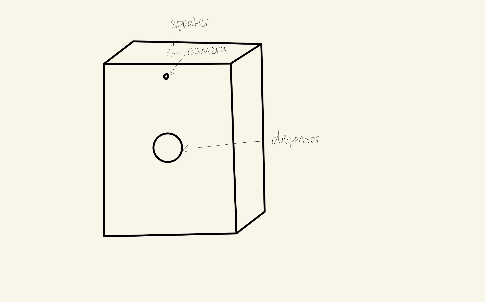
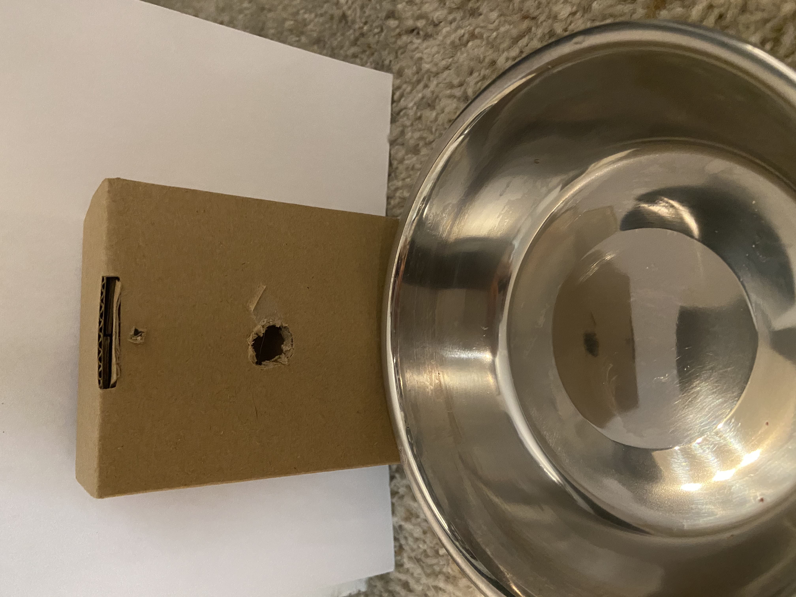
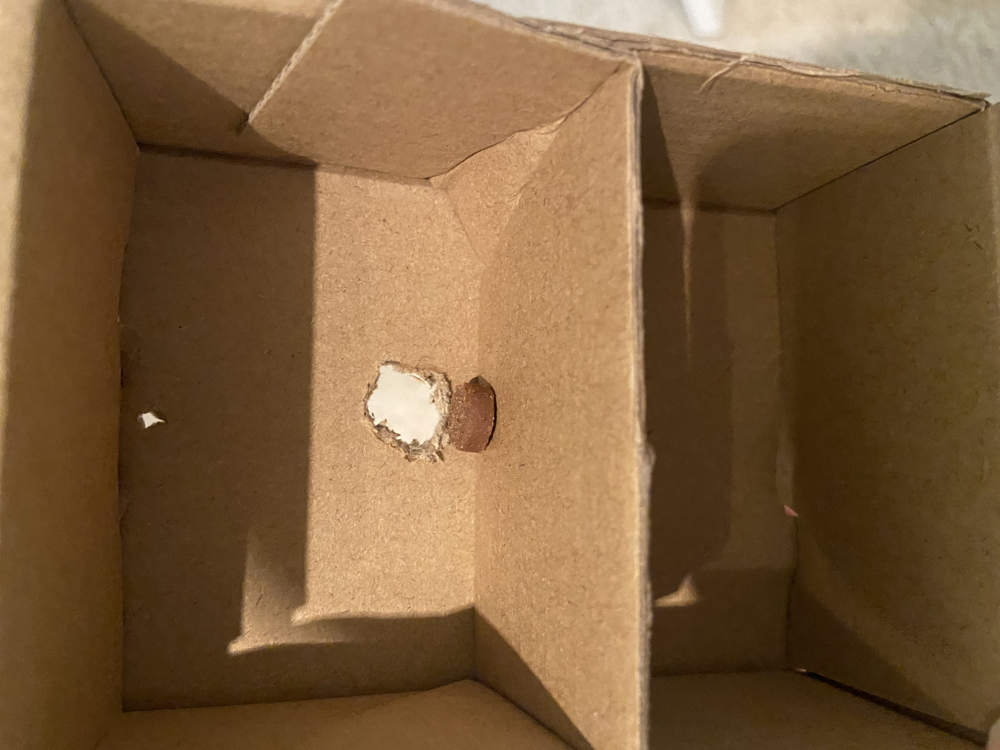

# Staging Interaction

In the original stage production of Peter Pan, Tinker Bell was represented by a darting light created by a small handheld mirror off-stage, reflecting a little circle of light from a powerful lamp. Tinkerbell communicates her presence through this light to the other characters. See more info [here](https://en.wikipedia.org/wiki/Tinker_Bell). 

### For lab, you will need:

1. Paper
1. Markers/ Pen
1. Smart Phone--Main required feature is that the phone needs to have a browser and display a webpage.
1. Computer--we will use your computer to host a webpage which also features controls
1. Found objects and materials--you’ll have to costume your phone so that it looks like some other device. These materials can include doll clothes, a paper lantern, a bottle, human clothes, a pillow case. Be creative!
1. Scissors

### Deliverables for this lab are: 
1. Storyboard
1. Sketches/photos of costumed device
1. Any reflections you have on the process.
1. Video sketch of the prototyped interaction.
1. Submit these in the lab1 folder of your class [Github page], either as links or uploaded files. Each group member should post their own copy of the work to their own Lab Hub, even if some of the work is the same for each person in the group.

## Overview
For this assignment, you are going to 

A) [Plan](#part-a-plan) 

B) [Act out the interaction](#part-b-act-out-the-interaction) 

C) [Prototype the device](#part-c-prototype-the-device)

D) [Wizard the device](#part-d-wizard-the-device) 

E) [Costume the device](#part-e-costume-the-device)

F) [Record the interaction](#part-f-record)

## The Report
This readme.md page in your own repository should be edited to include the work you have done. You can delete everything but the headers and the sections between the **stars**. Write the answers to the questions under the starred sentences. Include any material that explains what you did in this lab hub folder, and link it in the readme.

Labs are due on Mondays. Make sure this page is linked to on your main class hub page.

## Part A. Plan 

**Describe your setting, players, activity and goals here.**

_Setting:_ The interaction is happening in my living room. The interaction happens when I uses the device to train my dog how to sit.

_Players:_ My dog Martin and I will be involved in the interaction. Other people may also be in the setting, but the device will only respond to one person and one dog at a time.

_Activity:_ When I say "sit", if Martin sits down and remains still for five seconds, the device will turn green to indicate that I should give him a treat.

_Goals:_ Martin's goal is to get a treat. My goal is to give him a treat when he sits down for five seconds.

I would like to design a device to help me train my dog simple commands such as "sit" and "come". Ideally this device should be activated with a voice input. It will also have a camera that needs to be pointed to a dog to recognize the dog's gesture.

**Include a picture of your storyboard here**

**Summarize feedback you got here.**

My classmates think that the device can be helpful for training a dog. With some adjustment, the device can be designed as an automatic feeder.

## Part B. Act out the Interaction

**Are there things that seemed better on paper than acted out?**

Giving a treat while I am holding the device is not very convenient, but if I put the device on the ground, the devie cannot always point to my dog because he loves to move around. Therefore, I still decided to hold the device while performing the actions. I'm also going to change 5 seconds to 3 seconds because Martin doesn't like to sit for long.

**Are there new ideas that occur to you or your collaborators that come up from the acting?**

One idea that occurs to me from the acting is to attach the device to Martin. In this case, no camera is needed to detect if Martin is in the sitting position. However, the device needs to be lightweight so that the dog can comfortably wear it. 

## Part C. Prototype the device

<<<<<<< HEAD
=======
You will be using your smartphone as a stand-in for the device you are prototyping. You will use the browser of your smart phone to act as a “light” and use a remote control interface to remotely change the light on that device. 

Code for the "Tinkerbelle" tool, and instructions for setting up the server and your phone are [here](https://github.com/FAR-Lab/tinkerbelle).

We invented this tool for this lab! 

If you run into technical issues with this tool, you can also use a light switch, dimmer, etc. that you can can manually or remotely control.

>>>>>>> FAR-Lab-Spring2021
**Give us feedback on Tinkerbelle.**

I cannot connect to the localhost using Python 3.8. After I updated to 3.9 it works.

## Part D. Wizard the device

**Include your first attempts at recording the set-up video here.**

Here's my first attempt at setting up the wizarding set-up.

https://youtu.be/qkzSsuCgXVg

**Show the follow-up work here.**

I asked my roommate to remotely control the device while I'm acting.

https://youtu.be/LlPKwBYzgYA

## Part E. Costume the device

**Include sketches of what your device might look like here.**

**What concerns or opportunitities are influencing the way you've designed the device to look?**

When designing the look of the device, I want it to be lightweight because it needs to be handheld by the actor. Water might be a danger, so it would be good to have at least some sort of water resistant treatment on the costume.

I used a paper box to cover my phone so that the device is lightweight. The paper box is plastic-coated and is not completely water resistant, but it should be able to withstand incidental contact with water. I cut off a square on the box to show the screen. 

## Part F. Record

**Take a video of your prototyped interaction.**

https://youtu.be/E7K-R0XNDok

**Please indicate anyone you collaborated with on this Lab.**

I'd like to thank Andrew Tsai, Haoran Yin, and Tianyou Xiao for providing me feedback on the interaction plan.

# Staging Interaction, Part 2 

## Prep (to be done before Lab on Wednesday)

**Summarize feedback from your partners here.**

I exchanged feedback with Snigdha Singhania, Caitlin Stanton, Zhonghao Zhan, Jingjun Wang, and Yanjun Zhou.

1) Adding a count-down sound so that the user can have a bettering understanding of the time (Yanjun).
2) Expanding it to voice or vibrations. It can be beneficial to the visually impaired to treat their pets when they’re following orders (Snigdha).
3) Can be integrated into the device to train Martin automatically (Jingjun).
4) It has a great potential for developing even more features such as understanding color/voice commands (Zhonghao).
5) It seems a bit inconvenient to hold while also holding the treat and could also prove to be an issue if you need to be more hands on with your dog. Integrating it into a two part device with a collar and a treat dispenser would be a good idea (Caitlin). 

## Make it your own

Do last week’s assignment again, but this time: 
1) It doesn’t have to (just) use light, 
2) You can use any modality (e.g., vibration, sound) to prototype the behaviors, 
3) We will be grading with an emphasis on creativity. 

<<<<<<< HEAD

=======
>>>>>>> FAR-Lab-Spring2021
**Document everything here.**

_Setting:_ The interaction is happening in my living room. The interaction happens when I uses the device to train my dog how to sit.

_Players:_ My dog Martin. I will remotely enable the device but will not be presenting in the scene. 

_Activity:_ When the device gives a command "sit", the device will count down three seconds as Martin sits down. It will stop counting down if Martin moves. If Martin successfully follows the command, the device will dispense a treat.

_Goals:_ Martin's goal is to follow the command to get a treat.

The device is designed for dog training and it does not require the owner to be present in the scene. The user can remotely activate the device to play a prerecorded command. A built-in camera will recognizes Martin's gesture to determine if he follows the command.

When acting out the interaction, I found it difficult for Martin to get used to the device. Therefore, I decided to use a toy dog for the prototyped interaction.

I drill a hole on the box to dispense the treat. A phone with prerecorded command is hidden behind the box.

https://youtu.be/7ce4RckPG0c
