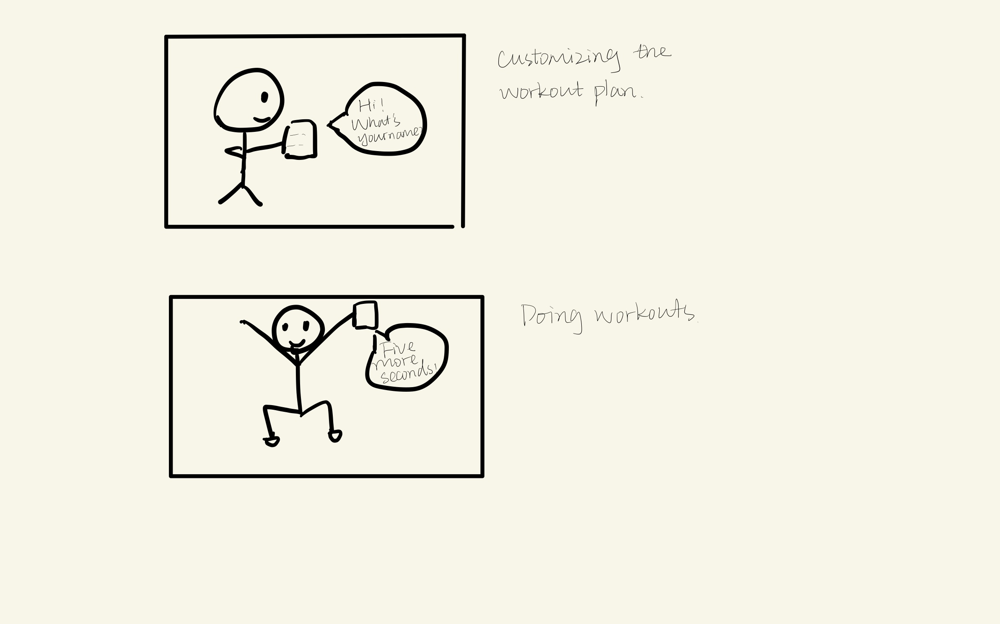
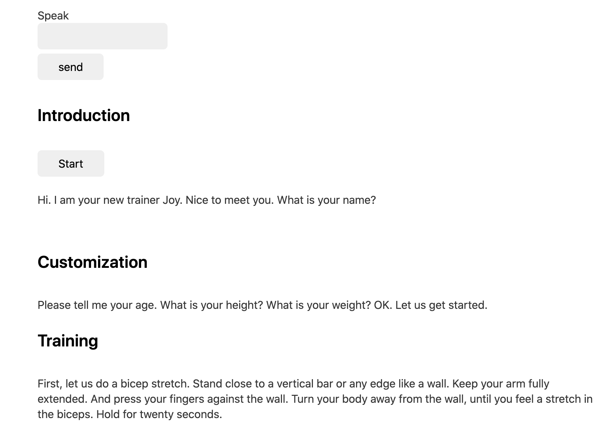

# You're a wizard, Erin Gong


In this lab, we want you to practice wizarding an interactive device as discussed in class. We will focus on audio as the main modality for interaction but there is no reason these general techniques can't extend to video, haptics or other interactive mechanisms. In fact, you are welcome to add those to your project if they enhance your design.


## Text to Speech and Speech to Text

In the home directory of your Pi there is a folder called `text2speech` containing some shell scripts.

```
pi@ixe00:~/text2speech $ ls
Download        festival_demo.sh  GoogleTTS_demo.sh  pico2text_demo.sh
espeak_demo.sh  flite_demo.sh     lookdave.wav

```

you can run these examples by typing 
`./espeakdeom.sh`. Take some time to look at each script and see how it works. You can see a script by typing `cat filename`

```
pi@ixe00:~/text2speech $ cat festival_demo.sh 
#from: https://elinux.org/RPi_Text_to_Speech_(Speech_Synthesis)#Festival_Text_to_Speech

echo "Just what do you think you're doing, Dave?" | festival --tts

```

You can also play audio files directly with `aplay filename`.

After looking through this folder do the same for the `speech2text` folder. In particular, look at `test_words.py` and make sure you understand how the vocab is defined. Then try `./vosk_demo_mic.sh`

## Serving Pages

In Lab 1 we served a webpage with flask. In this lab you may find it useful to serve a webpage for the controller on a remote device. Here is a simple example of a webserver.

```
pi@ixe00:~/$ python server.py
 * Serving Flask app "server" (lazy loading)
 * Environment: production
   WARNING: This is a development server. Do not use it in a production deployment.
   Use a production WSGI server instead.
 * Debug mode: on
 * Running on http://0.0.0.0:5000/ (Press CTRL+C to quit)
 * Restarting with stat
 * Debugger is active!
 * Debugger PIN: 162-573-883
```
From a remote browser on the same network, check to make sure your webserver is working by going to [http://ixe00.local:5000]()


## Demo

In the [demo directory](./demo), you will find an example wizard of oz project you may use as a template. **You do not have to** feel free to get creative. In that project, you can see how audio and sensor data is streamed from the Pi to a wizard controller that runs in the browser. You can control what system says from the controller as well.

## Optional

There is an included [dspeech](./dspeech) demo that uses [Mozilla DeepSpeech](https://github.com/mozilla/DeepSpeech) for speech to text. If you're interested in trying it out we suggest you create a seperarate virutalenv. 


# Lab 3 Part 2

Create a system that runs on the Raspberry Pi that takes in one or more sensors and requires participants to speak to it. Document how the system works and include videos of both the system and the controller.

## Prep for Part 2

I'm planning to design a smart workout assistant that instructs the user to do exercises. The user would be able to speak to the system about their age, height, and weight and receive a customized training plan.



## Share your idea sketches with Zoom Room mates and get feedback

*what was the feedback? Who did it come from?*

## Prototype your system

The system should:
* use the Raspberry Pi 
* use one or more sensors
* require participants to speak to it. 

*Document how the system works*

The system should work like a smart trainer that customizes a workout plan for the user. It will first introduce itself, and then ask users about their personal information. During training, the system should be able to detect the user's gesture and give verbal suggestion when necessary. 

The WoZ system has the same setup as in the demo. The wizard can listen to the user by clicking on the Eavesdrop button. When the button Start is clicked, the system will play an introduction to the user. In order to make the conversation between the system and the user more natural, I decided to put a script on the controller so that the wizard can copy and paste the speech when needed (see the screenshot below). The wizard can also improvise a speech based on the interaction with the user.

The accelerometer is used to determine if the user has followed the instructions given by the system to hold the gesture still. The user should hold the accelerometer by hand.

*Include videos or screencaptures of both the system and the controller.*



## Test the system
Try to get at least two people to interact with your system. (Ideally, you would inform them that there is a wizard _after_ the interaction, but we recognize that can be hard.)

I'm only able to recruit one person to interact with my system. I let the user know that this system is supposed to be a smart trainer and that the accelerometer is used to measure his gesture accuracy before the interaction. However, due to the length of the cables, I didn't let him perform a full gesture as one would usually do for workouts.

Answer the following:

### What worked well about the system and what didn't?
The speech part worked well while the gesture recognition part didn't. Since the wizard can input speech freely based on the interaction with the uesr, the conversation was very natrual. The gesture recognition part wasn't very successful because the longest Qwiic/Stemma cable cannot allow the user to stretch his arm while holding the accelerometer.

### What worked well about the controller and what didn't?

The conversation was natural but since the wizard has to type in the text in respond to the user, the user sometimes has to wait for the system's response.

### What lessons can you take away from the WoZ interactions for designing a more autonomous version of the system?

When the conversation seems natural, the users tend to talk to the system in long sentences just like the way they talk to human beings. Therefore, a more robust nlp system instead of a simple keyword recognizer is needed for an autonomous version of the system.


### How could you use your system to create a dataset of interaction? What other sensing modalities would make sense to capture?

I could use the system to record the completion rate for each workout gesture so that the user can review his workout performances over time. To measure more gestures, a gyroscrope would make sense to capture rotations.


